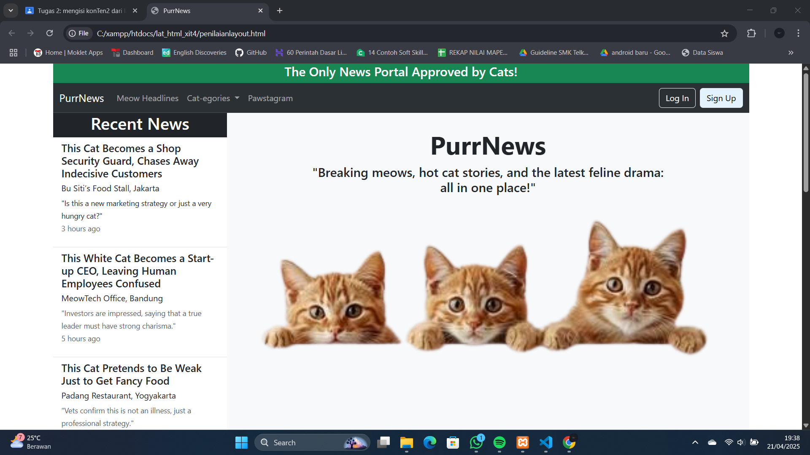
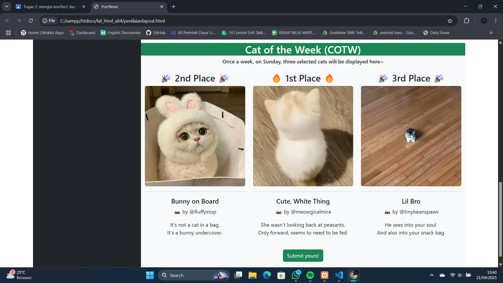
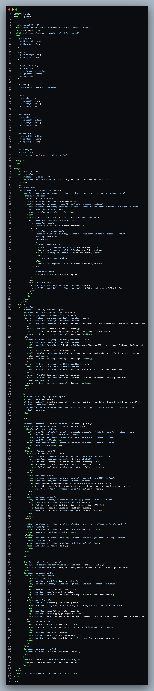

# Website Landing Page Project

Website ini dibuat dengan **HTML** dan **Bootstrap** sebagai hasil dari tugas mata pelajaran **Rekayasa Perangkat Lunak (RPL)** untuk jurusan **Teknik Komputer dan Jaringan (TKJ)**.

---

## 🛠️ Teknologi yang Digunakan
- HTML5
- CSS3
- Bootstrap 5

## 📄 Deskripsi
Website ini merupakan bagian dari proyek pembelajaran di kelas. Tujuan dari tugas ini adalah untuk mengasah kemampuan dalam membuat halaman web yang responsive dan menarik secara visual menggunakan Bootstrap.

> Karena file full website berada di laptop lama saya yang sedang rusak, saat ini saya belum bisa menampilkan versi **Live Demo**-nya. **Sebagai gantinya**, berikut dua gambar dari tampilan landing page website saya:

## Cuplikan Kode HTML

Berikut adalah kode yang saya pakai untuk membuat tampilan landing page untuk dua gambar di atas:

  
   
  <em>Kode yang saya gunakan untuk membuat landing page Purrnews</em>

> Saya membuat landing page tersebut menggunakan **VS Code**, yang berarti fitur **CSS** dan **JavaScript** tersedia melalui **Bootstrap**. Namun seperti yang saya sampaikan sebelumnya, full folder kode tersebut berada di **laptop lama saya yang sedang rusak**. 
> Jadi, untuk saat ini saya hanya bisa menampilkan **preview kode HTML**, dan tidak bisa memberikan **live demo** karena file bootstrap lengkapnya tidak tersedia.
